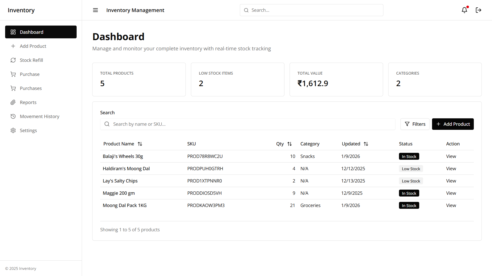

# Stock-Flow

**Stock-Flow** is a comprehensive inventory management and stock tracking application that combines real-time stock monitoring with modern web technologies. It provides users with an efficient inventory management experience featuring dynamic dashboards, detailed product tracking, and an intuitive interface for managing stock movements.

The platform is built with a modern technology stack, including **Next.js**, **TypeScript**, **React**, **Tailwind CSS**, and **MongoDB**, ensuring a highly performant, responsive, and engaging user experience.

---

### Copyright Notice

**Stock-Flow**

Copyright © 2025 Manish Sonawane. All rights reserved.

This project, **Stock-Flow**, is a demonstration of a modern inventory management application combining intuitive design with cutting-edge technology. Unauthorized use, modification, or distribution of the software or its components is prohibited unless explicitly stated under the terms of the license.

By using or contributing to this project, you agree to comply with the terms and conditions defined in the license. You may use the software for personal or educational purposes, provided that proper credit is given to the original author.

---

### License Information

This project is licensed under the MIT License. Please refer to the `LICENSE` file in this repository for detailed license information. The terms of the license govern the use, distribution, and modification of the software.

---

### Disclaimer

The software is provided "as-is" without warranty of any kind, express or implied, including but not limited to the warranties of merchantability, fitness for a particular purpose, and non-infringement. In no event shall the authors or copyright holders be liable for any claim, damages, or other liability, whether in an action of contract, tort, or otherwise, arising from, out of, or in connection with the software or the use or other dealings in the software.

---

### Trademarks

Any trademarks, service marks, or other marks associated with this project or its components are the property of their respective owners.
